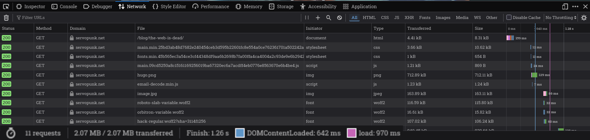
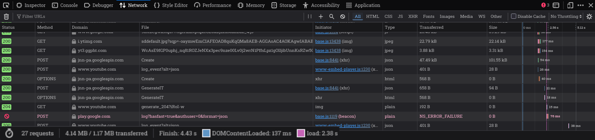

+++
title = "Privacy Respecting YouTube Embeds in HUGO using partials"
date = 2025-09-13T00:00:00-07:00
draft = true
tags = ['web', 'linux', 'hugo']
categories = ['blog']
image = "image.jpg"
transparentimg = "hugo.png"
summary = "Replacing YouTube embeds with just a image, and only loading the iframe embed after clicking."
+++

# !!! TODO: UPDATE PAGE AND DIRECTORY STRUCTURE TO v0.146.0  !!!

# The Problem

This Site is made using the static site generator [HUGO](https://gohugo.io/). This means it serves HTML, CSS, images and little to no JS to its users. This results in good loading times on even the slowest of connections, and the weakest of hardware:



Many articles would benefit from embedding Video content from YouTube - but look what it takes to load *just the video embed* on the same connection: 



Holy shit - *just* the embed takes 3.5x as long to load as the page around it. Google places cookies, runs its analytics to track this sites' users, it even sends a request to some google play store URL (???) and runs more JavaScript than I have HTML.

This post will describe a clean way to add custom privacy-respecting YouTube embeds using hugo's [shortcodes](https://gohugo.io/content-management/shortcodes/) system to improve loading times, user privacy, and page responsiveness.

If you're just interested in the finished product, skip ahead to [the finished product](#the-finished-product).

# Shortcodes

The cleanest way of adding embeds to your page is using HUGO's [shortcodes](https://gohugo.io/content-management/shortcodes/) system. For example, to create a (super simplified) custom YouTube embed, create the file `layouts/shortcodes/youtube.html`:

```html
{{- with $id := or (.Get "id") (.Get 0) -}}
  <iframe width="640" height="360" src="https://www.youtube.com/embed/{{ $id }}"></iframe> 
{{- else -}}
  {{- errorf "The %q shortcode requires a single positional parameter, the ID of the YouTube video. See %s" .Name .Position -}}
{{- end -}}

```

And vollià - you can now call `{{ youtube yTeTJzWYRWM }}` in your HTML and markdown files to embed a YouTube video. If you want more features, take a look at the [official HUGO YouTube Shortcode](https://gohugo.io/shortcodes/youtube/) - though it still only embeds the bloated `<iframe>` with all the disadvantages listed above.

⚠ **Important: Breaking Changes in v0.146.0**

Hugo v0.146.0 introduced a major overhaul of the template and shortcode systems. Many third-party tutorials are now outdated. To avoid errors, refer strictly to the official [New Template System Overview](https://gohugo.io/templates/new-templatesystem-overview/).

# Developing the Solution

Here's how we will attack the problem: Only embed the video thumbnail into the page, add JavaScript that runs if we click it, and add the iframe only if the user clicks on the thumbnail.

We will use a `<a>` link element to act as a fallback and open the video in a new tab in case the JavaScript doesn't run:

```html
<a href="https://www.youtube.com/watch?v=dQw4w9WgXcQ" target="_blank" class="youtube-preview-privacy" data-youtube-id="dQw4w9WgXcQ" style="display: block; width: 640px; aspect-ratio: 16 / 9; background: center / cover url('https://i.ytimg.com/vi/dQw4w9WgXcQ/hqdefault.jpg');"> </a>
```

Notice the `data-youtube-id` property: It contains the Video ID for us to load. Our JS can search for all DOM elements with the `youtube-preview-privacy` class and through JavaScripts `dataset` functionality extract the ID from it, and then replace the `<a>`'s "open link in new tab" functionality with our "create new iframe" functionality:

```js
const replaceWithYouTubeIframe = el => {
  let id = el.dataset.youtubeId || '';
  el.style.background = 'none';

  const iframe = document.createElement('iframe');
  iframe.src = `https://www.youtube-nocookie.com/embed/${id}?autoplay=1`;
  iframe.title = 'YouTube video player';
  iframe.allowFullscreen = true;
  Object.assign(iframe.style, { position: 'absolute', inset: '0', width: '100%', height: '100%', border: '0', display: 'block' });

  el.appendChild(iframe);
};

document.addEventListener('DOMContentLoaded', () => {
  document.querySelectorAll('.youtube-preview-privacy').forEach(el => {
    el.addEventListener('click', e => { e.preventDefault(); replaceWithYouTubeIframe(el); }, { once: true });
  });
});

```

That would be the proof-of-concept done - Now we only need the red YouTube logo in the center, a loading spinner, error handling, sanitization, HUGO shortcode files for embedding, the JS file in our header.

Also, by fetching the thumbnail from the `i.ytimg.com` servers, we still leak the users' IP and user-agent to Google, so we use HUGO's `resources.GetRemote` to fetch and cache the thumbnail on our server, locally.

I'll save you the specifics, feel free to inspect my implementation on [GitHub](github.com/reogaro/web), and present the finished product:

# The finished product

The following embed was created by calling ``:



To use the finished product on your page, you need to add the following to your project:

- [HUGO Shortcode](https://github.com/reogaro/web/blob/master/themes/kyber/layouts/shortcodes/youtube-privacy.html) to `themes/{your theme here}/layouts/shortcodes/youtube-privacy.html`
- [JavaScript](https://github.com/reogaro/web/blob/master/themes/kyber/assets/js/youtube-privacy.js) to `themes/{your theme here}/assets/js/youtube-privacy.js`

And the JavaScript to your `<header>`. You could just add it indiscriminately to all pages by adding `{{ partialCached "head/js.html" . }}` to your HTML (most likely `themes/{your theme here}/layouts/partials/head.html`), or be selective and add it only on the pages [where the Shortcode is used](https://gohugo.io/templates/shortcode/#detection), ([see example](https://github.com/reogaro/web/blob/master/themes/kyber/layouts/partials/head.html)):

```
{{ if .HasShortcode "youtube-privacy" }}
  {{- with resources.Get "js/youtube-privacy.js" }}
    {{- if eq hugo.Environment "development" }}
      {{- with . | js.Build }}
        <script src="{{ .RelPermalink }}" defer></script>
      {{- end }}
    {{- else }}
      {{- $opts := dict "minify" true }}
      {{- with . | js.Build $opts | fingerprint }}
        <script src="{{ .RelPermalink }}" integrity="{{- .Data.Integrity }}" crossorigin="anonymous" defer ></script>
      {{- end }}
    {{- end }}
  {{- end }}
{{ end }}

```

And vollià - You have improved loading times and your users' privacy at the cost of - well, nothing really. Ten minutes of work at most. Happy Hacking!

