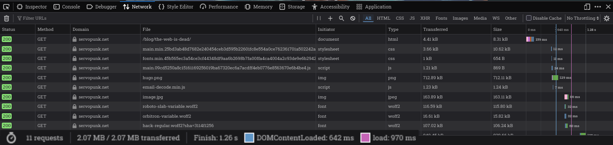
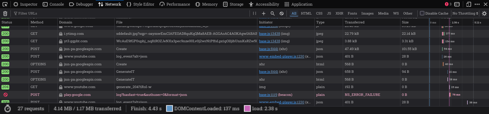

+++
title = "Privacy Respecting YouTube Embeds in HUGO"
date = 2025-09-27T00:00:00-07:00
draft = false
tags = ['web', 'linux', 'hugo']
categories = ['blog']
image = "privacy-jail.jpg"
transparentimg = "gopher-police.svg"
summary = "How to embed YouTube videos without inviting Alphabet Inc."
+++

This embed system quarantines the YouTube `<iframe>` embed (and its megabytes of telemetry) with a lightweight image placeholder. Google's tracking scripts are only loaded if the user clicks it.


It uses standard [Obsidian.md-inspired](https://obsidian.md/help/embed-web-pages#Embed+a+YouTube+video) Markdown, protects user privacy, and dramatically reduces page load times:

```md

```

To integrate this into your own project, copy the following components:

1. **Hugo Render Hook**: Routes Markdown image tags containing YouTube URLs. Save to `themes/{your theme}/layouts/_default/_markup/render-image.html`. [View Code](https://github.com/reogaro/web/blob/main/themes/kyber/layouts/_default/_markup/render-image.html)
2. **Hugo Partial**: Handles HTML generation and thumbnail fetching. Save to `themes/{your theme}/layouts/partials/youtube-privacy.html`. [View Code](https://github.com/reogaro/web/blob/main/themes/kyber/layouts/partials/youtube-privacy.html)
3. **JavaScript**: Handles the click event to swap the placeholder with the iframe. Save to `themes/{your theme}/assets/js/youtube-privacy.js`. [View Code](https://github.com/reogaro/web/blob/main/themes/kyber/assets/js/youtube-privacy.js)

The JavaScript is injected dynamically by the partial via Hugo's `.Page.Store` exactly once per page.

---

## The Problem: Performance and Privacy

Static site generators like [Hugo](https://gohugo.io/) excel at delivering pure hand-optimized HTML and CSS, ensuring ultrafast load times. Injecting a standard YouTube embed negates this advantage entirely, slowing load times to their "web 3.0" speeds:



A native YouTube `<iframe>` silently loads megabytes of JavaScript. In testing, the embed alone took significantly longer to load than the entire surrounding blog post including images.

Like bolting a jet engine to a bicycle, this page's cargo rack just broke off.



Worse, Google uses these iframes like a trojan horse to deposit tracking cookies before the user even considers clicking play. They have no legitimate reason to know you are reading this post, and now, they won't.

## The fix

The solution involves three stages: 
1. **Routing**: Intercepting the Markdown.
2. **Templating**: Fetching the thumbnail and generating the DOM.
3. **Hydration**: Swapping the DOM element upon interaction via minimal JavaScript.

### 1. The Render Hook

We avoid Hugo-specific shortcodes (`{\{< ... >}\}`) and use Hugo's [Markdown Render Hooks](https://gohugo.io/templates/render-hooks/). This allows standard `` syntax for when you get excited by new shiny thing. The hook `render-image.html` uses Regex to intercept YouTube URLs and passes the ID to a HUGO partial:

```html
{{- /* Intercept YouTube URLs */ -}}
{{- if findRE `^(https?://)?(www\.)?(youtube\.com|youtu\.be)/` .Destination -}}
  {{- /* Extract the ID using regex and pass to our partial */ -}}
  {{- $id := replaceRE `^.*(?:youtu\.be/|v=)([^&?]+).*` `$1` .Destination -}}
  {{- partial "youtube-privacy.html" (dict "id" $id "Page" .Page) -}}

{{- else -}}
  {{- /* Standard image output */ -}}
  
{{- end -}}
```

### 2. The Partial

The `youtube-privacy.html` partial is responsible for generating the initial static placeholder. To prevent leaking the user's IP to Google's thumbnail servers (`i.ytimg.com`), the partial uses Hugo's `resources.GetRemote` to fetch, cache, and serve the thumbnail directly from your build server. This successfully severs the last remaining telemetry thread Google had.

*Note: This means your build server will contact YouTube servers. If this is a concern, consider proxying the build requests, or moving into the woods.*

The partial outputs an `<a>` link element configured with the fetched thumbnail as a background image. It uses `data-youtube-id` to pass state to the JavaScript:

```html
<a href="https://www.youtube.com/watch?v=dQw4w9WgXcQ" target="_blank" class="youtube-preview-privacy" data-youtube-id="dQw4w9WgXcQ" style="background: center / cover url('/images/yt/dQw4w9WgXcQ.jpg');"> </a>
```

### 3. The JavaScript

The JavaScript executes when the DOM is ready. It targets the `.youtube-preview-privacy` class, intercepts the click event, and dynamically injects the `<iframe>` using the `youtube-nocookie.com` domain with `autoplay=1`. Only when the user explicitly consents by clicking the thumbnail do we finally permit Google's player to load. 

```js
const replaceWithYouTubeIframe = el => {
  let id = el.dataset.youtubeId || '';
  el.style.background = 'none';

  const iframe = document.createElement('iframe');
  iframe.src = `https://www.youtube-nocookie.com/embed/${id}?autoplay=1`;
  iframe.title = 'YouTube video player';
  iframe.allowFullscreen = true;
  Object.assign(iframe.style, { position: 'absolute', inset: '0', width: '100%', height: '100%', border: '0', display: 'block' });

  el.appendChild(iframe);
};

document.addEventListener('DOMContentLoaded', () => {
  document.querySelectorAll('.youtube-preview-privacy').forEach(el => {
    el.addEventListener('click', e => { e.preventDefault(); replaceWithYouTubeIframe(el); }, { once: true });
  });
});
```

Because the partial leverages Hugo's `.Page.Store`, the full production JavaScript (which includes error handling and a loading spinner) is fingerprinted and injected automatically.

---

### Update: Mid-2026 Architectural Changes

If you read an earlier version of this post, it instructed you to use Hugo Shortcodes (`{\{< youtube-privacy ID >}\}`). That architecture contained two flaws:

1. **Markdown Vendor Lock-in**: Shortcodes tightly couple content to Hugo. Migrating to another SSG (like Astro or Next.js) would break all video embeds.
2. **Template Limitations**: Hugo shortcodes only evaluate inside Markdown content. The embed could not be used natively in layout files like `home.html`.

The current architecture resolves both issues. The logic was extracted into `layouts/partials/youtube-privacy.html` for global layout support, and the Markdown interface was replaced entirely with `render-image.html`, restoring standard, portable Markdown syntax.

*(Note: The GitHub links above point to the main branch. If you need the legacy shortcode implementation, review [older commits](https://github.com/reogaro/web/tree/ce132cc201c4c55a72dd309d5982feb607d8d6cf)).*
