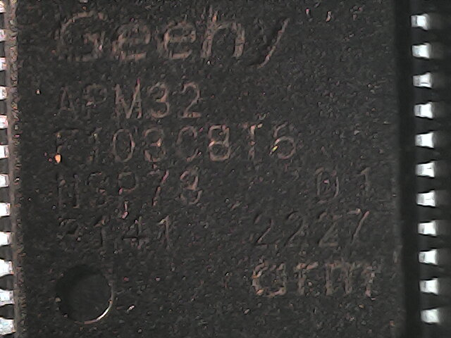
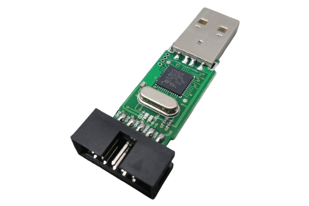

+++
title = 'STM32 Development for Cheapskate Tinkerers'
date = 2024-09-15T09:00:00-07:00
draft = false
tags = ['embedded', 'linux']
categories = ['blog']
image = 'st-link-clone.jpg'
transparentimg = "stlinkv2.png"
summary = "A lesson on failing over and over and over and over. On STM32, clones, flashing and debugging with black magic."
+++

# The allure of AliExpress

I am a cheapskate. This also applies to projects involving microcontrollers, so it should come as no surprise that I love the cheap chinese "Blue Pill" STM32 boards. After gathering experience with these boards, I recommend to anyone planning a project: **Don't use these**.

There is so much variability in circuit boards, controllers and clone chips you could receive upon ordering, if you like finishing projects you need to avoid these boards. With that said, I like tinkering so here's a list of solutions to common problems:

# Clone STM32 chips

The boards often ship with STM32 clone chips. The clones tend to use the original parts name with a different prefix, e.g. STM32 becomes APM32.



## CKS32F103C8T6

The **CKS** ```CKS32F103C8T6``` chip is a clone of the ST ```STM32F103C8T6```. The manufacturer CKS released a [Datasheet](https://www.lcsc.com/datasheet/lcsc_datasheet_2304140030_CKS-CKS32F103C8T6_C556576.pdf) for this clone. Most flashing software throws a bizarre error when trying to flash it:

```
"UNEXPECTED idcode: 0x2ba01477"
```

If you're looking for an explanation of this problem, [Hackaday](https://hackaday.com/2020/10/22/stm32-clones-the-good-the-bad-and-the-ugly/) does it quite well. If you're using [PlatformIO](https://platformio.org/), you can add `upload_flags = -c set CPUTAPID 0x2ba01477` to your `platformio.ini` to fix the problem.

For OpenOCD on linux systems: modify ```/usr/share/openocd/scripts/target/stm32f1x.cfg```
```
#set _CPUTAPID 0x1ba01477
set _CPUTAPID 0x2ba01477
```

# USB Problems with STM32F103C8T6 boards

Some boards with `STM32F103C8T6` chips (or clones) have a incorrect USB D+ resistor. R10 should normally be 1.5k, but gets populated with 10K or 4.7K at times. The cleanest solution is to just swap it, though there exist [other solutions](http://amitesh-singh.github.io/stm32/2017/05/27/Overcoming-wrong-pullup-in-blue-pill.html).


# Flashing Black Magic Probe



My preferred tool for flashing and debugging STM32 systems is a chinese ST-Link debugger running the [Black Magic Probe](https://black-magic.org/) firmware. To create this tool, you need to buy two chinese ST-Link V2 clones, compile Black Magic Firmware, and use one ST-Link to flash the other.

[This tutorial](https://ciesie.com/post/black_magic_probe_stlink/) by Michał Ciesielski describes the process for hooking everything up better than I ever could. The software/flashing part are out of date though, so take note of the following addendum:

At the time of writing, compiling the Black Magic firmware fails due to "insufficient memory" errors. Using a declarative Nix compilation environment fixed this:

```bash
git clone --recursive https://github.com/blackmagic-debug/blackmagic.git
cd blackmagic
git checkout v1.10.1
nix-shell
make clean
make PROBE_HOST=stlink
```

Optional flags to use on the `make` command:
```STLINK_FORCE_CLONE=1``` fixes the RST pin pinout to PB6 (needed for some boards)
```ST_BOOTLOADER=1``` to use the original ST bootloader instead of the blackmagic bootloader

Now for flashing. You can use [this updated stlink-tool for linux](https://github.com/GabyPCgeeK/stlink-tool) or OpenOCD to flash the firmware.

The address 0x08000000 marks the start of flash memory on STM32F103x8 chips. The bootloader (called blackmagic_dfu.bin) belongs at `0x08000000` if you're replacing it, the actual firmware at `0x08002000`.

You can flash the compiled bin file via the ST-Link using OpenOCD:

```bash
openocd -f interface/stlink.cfg -f target/stm32f1x.cfg -c 'program blackmagic.bin verify reset exit 0x08002000'
```


*Ressources that helped me figure this out:*  [Black Magic](https://github.com/blackmagic-debug/blackmagic/tree/main/src/platforms/stlink#reverting-to-original-st-firmware-with-running-bmp-firmware), [Phil Pemberton](https://philpem.me.uk/elec/stlink-blackmagic), [stm32-base](https://stm32-base.org/boards/#debuggers), [Michał Ciesielski](https://ciesie.com/post/black_magic_probe_stlink/) 
