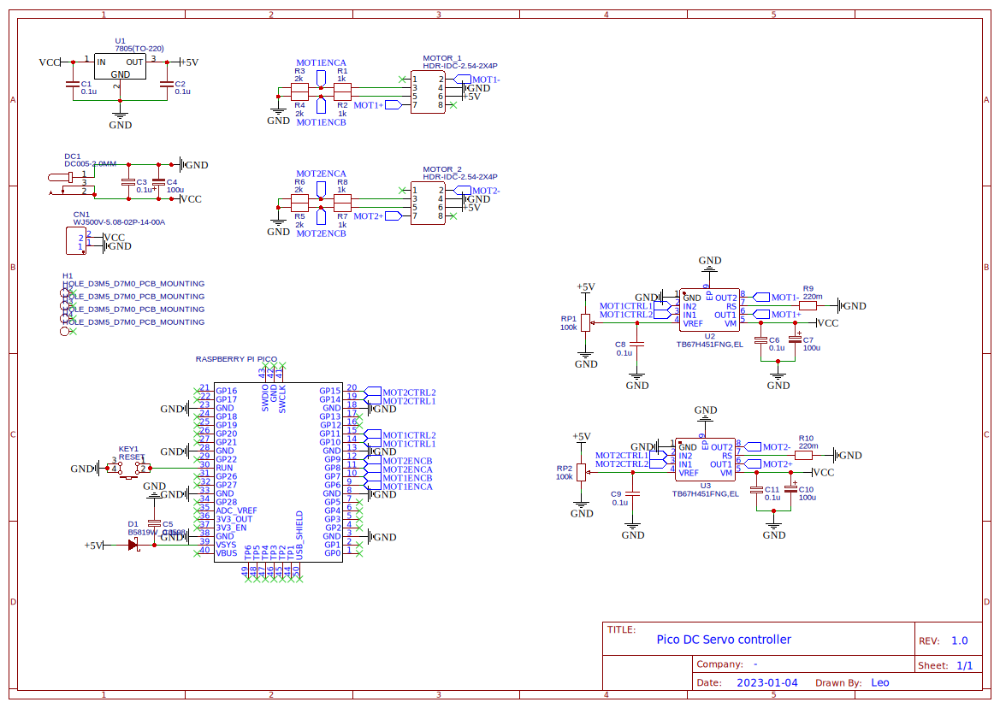
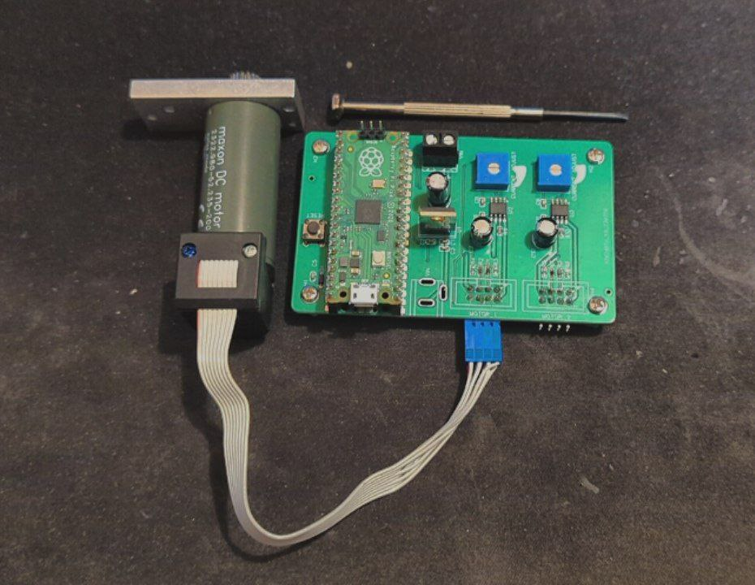

+++
title = 'DC Motorman'
date = 2023-03-15T11:00:00-07:00
draft = false
tags = ['machine','electronics','pico']
summary = '20W 2-channel DC Servo Driver'
categories = ['project']
image = 'pcb-only.jpg'
transparentimg  = 'motor.png'
+++

# DC Motorman

The "DC Servoman" is my nickname for a Pico DC Servo Controller circuit board, designed to control two DC motors with quadrature encoders via UART communication.



## Specifications

- Microcontroller: Raspberry Pi Pico
- Motor Driver ICs: TB67H451FNG motor drivers
- Power Regulation: 7805 voltage regulator
- DC Motors: Feedback via quadrature encoders
- Power Input: A 5V DC input via a DC jack (DC1)
- Communication: UART over Raspberry Pi Pico's GPIO pins or USB

## Circuit Design

The schematic of the project is divided into the following key areas:

Power Supply: The system operates with a regulated 5V supply using a 7805 voltage regulator with capacitors for voltage smoothing

Motor Driver: TB67H451FNG motor drivers control the two motors. There are two drivers for two motors.

Quadrature Encoders: The design goal was to control specific MAXXON motors with encoders, and so the resistor network had to be swapped for a diode based circuit. PIO in the Pi Pico makes keeping track easy.

There where two errors in design revision 1: The encoders I used couldn't even drive the miniscule currents needed for the voltage divider, and the barrel jack polarity was opposite of conventions (VCC out, GND in).

For revision 2, these errors should be rectified.

## Software

The software running on the Raspberry Pi Pico is responsible for motor control, encoder pulse counting, and communication. The key components are:

**UART Communication:** The motors can be controlled either through the Pico’s GPIO pins configured for UART or through the USB interface. You can send a target step count to reach.

**Flexible Encoder Pulse Counting:** The quadrature encoder signals are processed either by the Pico’s Programmable Input/Output (PIO) subsystem or classic interrupts. The PIO efficiently counts the pulses from the encoders without consuming CPU cycles, allowing for precise tracking of motor positions. This is essential for maintaining accurate control of motor movement. There is also a interrupt version available.

**Position Control via PID:** The motor positions are controlled using a Proportional-Integral-Derivative (PID) controller for position control. The PID control loop ensures that the motors reach the desired positions with minimal error. The PID constants (proportional, integral, and derivative gains) have been tuned using the Ziegler-Nichols method to ensure optimal response and stability in the system.

**Motor Control via PWM:** Pulse-width modulation (PWM) is used to control the speed of the motors.

## Conclusion

The Pico DC Servo Controller is a great learning experience for designing a circuit board. It successfully controls two DC motors with feedback from quadrature encoders. With further software improvements, this will be used in future software projects.

