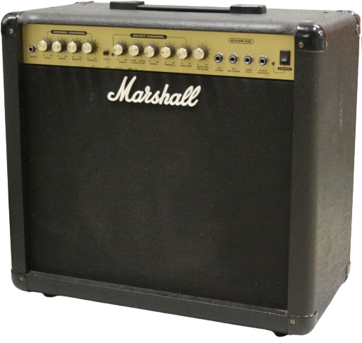
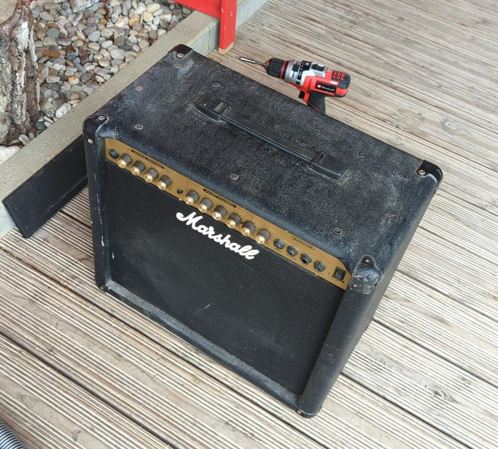
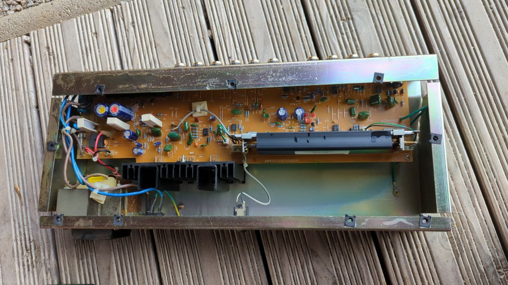
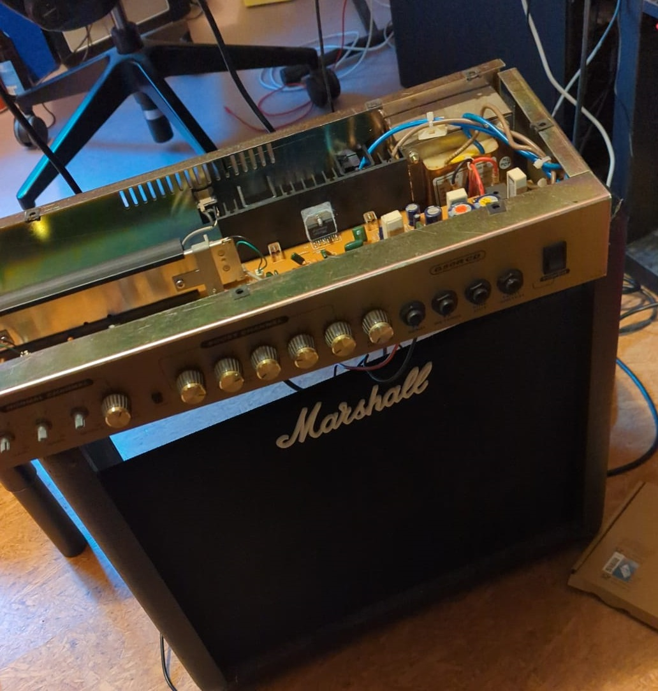
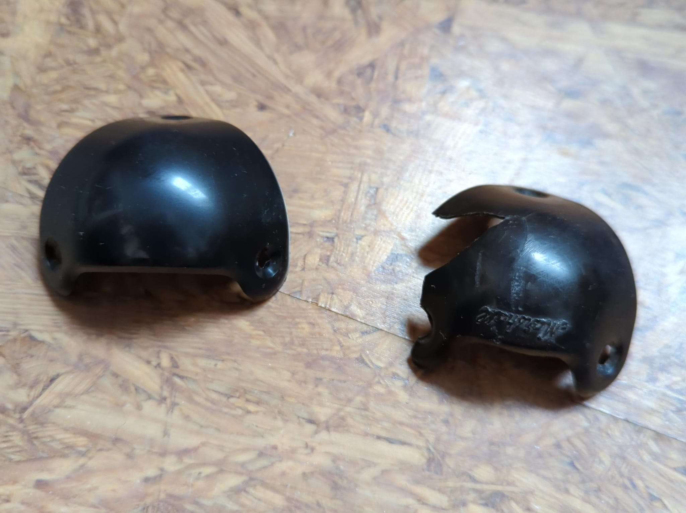

+++
title = 'Marshall G50R CD Amplifier Repair'
date = 2023-03-15T11:00:00-07:00
draft = false
tags = ['music', 'guitar', 'electronics']
summary = 'Fixing up a scrpyard find'
categories = ['project']
image = 'score.jpg'
+++

# Marshall G50R CD Repair

Or: How I got a free Marshall G50R CD combo amplifier from the scrapyard and fixed it up.

## Acquisition

I found the amp sitting in a container as I was dropping off some e-waste at our local scrapyard.
After asking, the worker there was nice enough to give it to me for free. What a legend, though he warned me it likely was broken. No problem, It'll be an easy fix! Right?

## Cleaning

The thing was filthy, so it got some thorough disassembly and cleaning action.

## Electrical Repair

Cleaning brought some electrical problems to light. A output cable from the amplifier to the speaker cone had broken off and four of the Potentiometers had damage. The cable was an easy fix, and the Potentiometers only slightly more involved.
I tried asking Marshall Support for help, and they unhelpfully provided incomplete schematics for reference, and sadly also forbid me from sharing them. They're available elsewhere on the internet though, if you know where to look.

So I had to desolder the potentiometers. They are labeled with their values, and so after extracting the circuit board I could note down their values and replace the problematic ones with the closest values I could find:

|             | NGain | NLow | NMid | NHigh | BGain | BCont | BBass | BTreble | BVol  | Reverb |
| ----------- | ----- | ---- | ---- | ----- | ----- | ----- | ----- | ------- | ----- | ------ |
| Annotation  | VR1   | VR3  | VR4  | VR2   | VR6   | VR9   | VR8   | VR7     | VR10  | VR5    |
| Value       | B200K | A1M  | B20K | B200K | A500K | B20K  | A1M   | B200K   | B100K | B20K   |
| Replacement | B220K |      | B22K |       |       |       |       |         | B100K | B22K   |

And with that, the electronics where working again. It was time to take care of the mechanical repairs.

## Mechanical Repair

### Corners

One of the corner protectors was cracked. The [Marshall corners](https://www.marshall.com/de/de/product/front-corners) shipping is hilariously overpriced, so I tried ordering [AliExpress](https://de.aliexpress.com/item/1005002467000614.html) replacements. They where of terrible quality and didn't fit. So instead of searching around for cosmetic parts for a multi-decade old piece of equipment, I just reinstalled the old one again.

### Screws

Many of the Screws where rusty and not black anymore. I wanted to take a crack at replacing them, but finding black screws in the right sizes proved to be impossible. Maybe this table of screws will help someone, they're almost certainly all imperial, but I noted down the closest metric screw size. The imperial measurements are pretty much guesses.

| Pcs | Screw     | Metric Approx. | Head Type   | Used for attaching  |
| --- | --------- | -------------- | ----------- | ------------------- |
| 2x  | M5x25     | M5x25          | Flat Head   | Handle              |
| 17x | #8 1 1/4" | 3,5x30         | Pan Head    | Electronics Box     |
| 5   |           | 3,5x25         | Pan Head    | Back Panel          |
| 4   |           | 3.5x16         | Button Head | Rubber Feet         |
| 28  | #6 3/4    | 3.5x12         | Flat Head   | Corners             |

## Conclusion

And thus, the amplifier was whole again. At least as whole as I'd make it. A happy day for me, a very sad day for my next-door neighbours.

