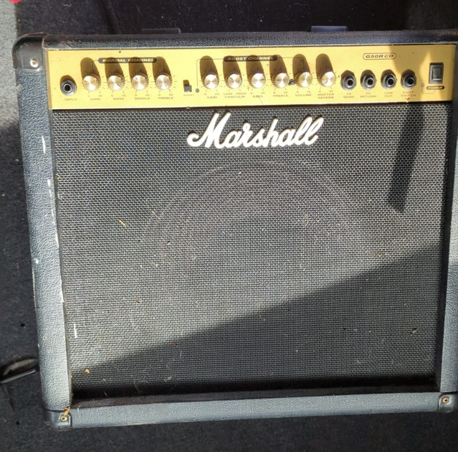

+++
title = 'Marshall G50R CD Amplifier Repair'
date = 2023-03-15T11:00:00-07:00
draft = false
tags = ['music', 'guitar']
summary = 'Fixing up a scrpyard find'
categories = ['project']
image = 'repair.jpg'
+++

# Marshall G50R CD Repair

Or: How I acquired a free Marshall G50R CD combo amplifier from the scrapyard and got it working again.

## Acquisition

I found the amp sitting in a container as I was dropping off some e-waste at our local scrapyard.
After asking, the worker there was nice enough to give it to me for free. What a legend, though he warned me it likely was broken. No problem, It'll be an easy fix! Right?

## Cleaning

The thing was filthy, so it got some good disassembly and cleaning action.

## Electrical Repair

Cleaning brought some electrical problems to light. A output cable had broken off and four of the Potentiometers had damage. The cable was an easy fix, and the Potentiometers only slightly more involved.
I asked Marshall Support for help, and they provided incomplete schematics for reference, but sadly also forbid me from sharing them.

So I was on my own to find replacements. Luckily the pots are labeled with their values, so after extracting the circuit board I could note down their values and replace the problematic ones:

|             | NGain | NLow | NMid | NHigh | BGain | BCont | BBass | BTreble | BVol  | Reverb |
| ----------- | ----- | ---- | ---- | ----- | ----- | ----- | ----- | ------- | ----- | ------ |
| Annotation  | VR1   | VR3  | VR4  | VR2   | VR6   | VR9   | VR8   | VR7     | VR10  | VR5    |
| Value       | B200K | A1M  | B20K | B200K | A500K | B20K  | A1M   | B200K   | B100K | B20K   |
| Replacement | B220K |      | B22K |       |       |       |       |         | B100K | B22K   |

*Note: Values differ slightly for ease of sourcing.*

And with that, the electronics where working again. It was time to take care of the mechanical repairs.

## Mechanical Repair

### Corners

One of the corner protectors was cracked. The [Marshall corners](https://www.marshall.com/de/de/product/front-corners) shipping is hilariously overpriced, so I ordered some [AliExpress](https://de.aliexpress.com/item/1005002467000614.html) replacement - big mistake. They don't fit right with the original 3/4" corner ID. Oh well, reinstalled the cracked one.

### Screws

Here's a table of all the screws used. Pretty sure they're imperial. No idea what exactly though, so I've approximated them in metric and guessed the imperial sizing. They're all Phillips Head. I decided to replace the very rusty ones with their metric approximations.

| Pcs | Screw     | Metric Approx. | Head Type   | Used for attaching  |
| --- | --------- | -------------- | ----------- | ------------------- |
| 2x  | M5x25     | M5x25          | Flat Head   | Handle              |
| 17x | #8 1 1/4" | 3,5x30         | Pan Head    | Electronics Box     |
| 5   |           | 3,5x25         | Pan Head    | Back Panel          |
| 4   |           | 3.5x16         | Button Head | Rubber Feet         |
| 28  | #6 3/4    | 3.5x12         | Flat Head   | Corners             |

## Conclusion

**Success!** It really was an easy fix. Just some manual labor and basic electronics knowledge.

