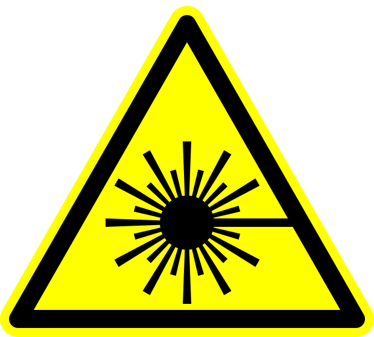

+++
title = 'Retina Remover 9000'
date = 2023-03-15T11:00:00-07:00
draft = false
tags = ['machine','laser']
summary = 'A 2W diode laser engraver'
categories = ['project']
image = 'retina-remover-9000-terrible-photo.jpg'
transparentimg  = 'laser-symbol.svg'
+++

# Retina Remover 9000


The Retina Remover 9000 was a school project. A friend and I designed and built a laser engraver from scratch (and got a perfect score!). It uses a cheap chinese 2W 450nm diode laser source with FluidNC Firmware and a CoreXY motion system to burn decorative patterns into wood, cardboard, plastic and more.

If it looks amateurish, keep in mind that this machine was built by two 17-year olds with no formal technical education.

This project was simple enough to build, a frame from 2020 aluminium extrusions, motion system using chinese import MGN12 rails, standard 3D printer parts for belts, motors, and pulleys, and a hand-soldered perfboard mainboard around a ESP32 dev kit. Reflecting on the project, it taught me a lot about mechatronics. If you are also interested, a project like this is a great beginner intro to building your own machines.

It is running [FluidNC](https://github.com/bdring/FluidNC), a fork of the popular GRBL firmware for ESP32 microcontrollers. It offers a web interface and runs on more powerful hardware, allowing for the CoreXY kinematics equasions to be solved without any performance concerns.

I am looking for the original project documentation and will add more information to this post once I find it. For now, you can admire it writing a poem:



```
roses are red
violets are blue
unexpected '{' at line 32
```

If you are wondering what is going on at about `0:22` of the video: Those are the laser goggles, they completely block the laser light - if you look through them, you can only see the burning wood, not the beam that is causing the burning.

# A warning on laser safety



Playing with Lasers is fun. But as with most fun things, they are also possibly very dangerous. Lasers above 500 mW fall into [Category IV](https://www.lasersafetyfacts.com/4/) and need to be treated with respect, they can and will remove your retina if you let them.

Even at 17 years old, I made sure to spend about a third of the projects budget on a pair of tested and certified laser safety goggles. Do not underestimate the danger a laser can do to your eyes. Just milliseconds of exposure can cause irrepperable damage to many parts of your eye.

Spare yourself a lifelong black spot in the center of your vision, invest in laser safety.

There are many ressources you can use to educate yourself on what is needed for safe laser operation:

- [Laser Safety Facts](https://www.lasersafetyfacts.com/)
- [Laser Pointer Safety](https://www.laserpointersafety.com/)
- (German) [BG Lasersicherheit](https://www.bgetem.de/medien-service/medienankuendigungen/unterweisungshilfe-lasersicherheit)

...and more. Happy Lazing!

